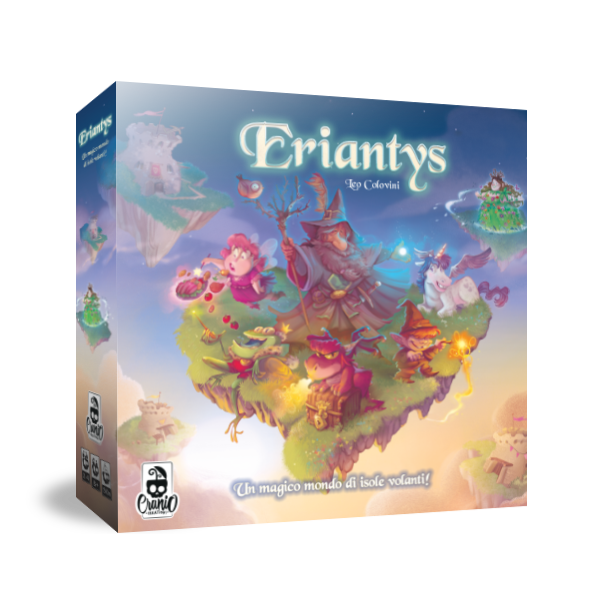

### ing-sw-2022-Previtera-Riccardi-Scaccia  

# Board game [Eriantys](http://www.craniocreations.it/prodotto/santorini/)



  
The game is playable starting a ServerApp and after using ClientApp CLI or GUI, the game is auto-guided to help the player to play.


## Gruppo GC02

- ###  10651584  [Francesco Riccardi](https://github.com/Frenk3D) <br>Email: francesco3.riccardi@mail.polimi.it / Cell. : +39 3313051309
- ###  10724922  [Nicolò Scaccia](https://github.com/NicoScaccia) <br>Email: nicolo.scaccia@mail.polimi.it / Cell. : +39 3662607385
- ###  10682248  [Marco Luca Previtera](https://github.com/MarcoLucaPrevitera) <br>Email: marcoluca.previtera@mail.polimi.it / Cell. : +39 3466776801

  
  
  
## Functionality
| Functionality    |                       State                        |
|:-----------------|:--------------------------------------------------:|
| Basic rules      | 🟢 |
| Complete rules   | 🟢 |
| Socket           | 🟢 |
| GUI              | 🟢 |
| CLI              | 🟢 |
| 4 players game   | 🟢 |
| 12 characters    | 🟢 |
| Multiple games   | 🟢 |


🔴 waiting...  
🟢 done  
🟡 work in progress...  


## Documentation
### UML (in the deliverables folder):
- [UMLFolder](https://github.com/Frenk3D/ing-sw-2022-Previtera-Riccardi-Scaccia/tree/main/deliveries/UMLFolder)

[OnTool](https://lucid.app/lucidchart/0321ec56-70d4-467c-a649-f40a982a14d6/edit?invitationId=inv_add26b2e-3f1d-4160-9073-47ba92254b02)

### How to use JARs (in the [deliverables folder](https://github.com/Frenk3D/ing-sw-2022-Previtera-Riccardi-Scaccia/tree/main/deliveries) ):
We create it with Maven Shade Plugin  
For server     ``` java -jar deliveries\JARfull\artifacts\softend-GC02-server.jar [-p <port_number>] ```  
For client-> cli: ``` java -jar deliveries\JARfull\artifacts\softend-GC02-client  -c   ```  
GUI: java  ``` -jar deliveries\JARfull\artifacts\softend-GC02-client ```  or with double-click on the file.


### JavaDoc
The following documentation includes a description for most of the classes and methods used, follows the Java documentation techniques, and can be accessed by generating it from code or here [JavaDoc](https://github.com/Frenk3D/ing-sw-2022-Previtera-Riccardi-Scaccia/tree/main/deliveries/JavaDoc(generabile%20da%20intellij))  
Starts from index.html.

### Test coverage (on Server):
Controller: ~73%  (methods that regards the communication are tested playing )  
Model: ~88%
  
  
### Libraries and Plugins (used and recommended by the course)
| Library/Plugin | Description                                                                              |
|----------------|------------------------------------------------------------------------------------------|
| __Maven__      | Build automation tool used primarily for Java projects. |
| __JavaFx__     | Graphic library to create user interfaces (more innovative than Swing).            |
| __JUnit__      | Unit testing framework (recommended by the course).                                       |    

### Other useful info/links:
Peer-reviews, JavaDoc (generable from intellij) and network protocol messages are in the deliverables folder.
